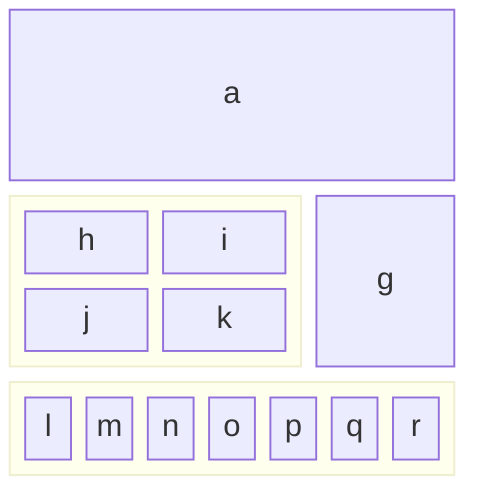

Control systems engineering is a field of study that deals with the design and analysis of systems that regulate the behavior of other systems. These systems can range from simple mechanical devices to complex industrial processes and everything in between. Understanding the principles of control systems is essential for engineers working in various domains, including aerospace, automotive, robotics, and manufacturing.

This post will cover about Introduction to Control Systems:
   - Definition and purpose of control systems
   - Types of control systems (open-loop, closed-loop)
   - Components of a control system
   - Block diagram representation

## Definition and purpose of control systems

Definition: Control systems are systems that can be manipulated to achieve specific objectives. They are designed to improve the performance, reliability, and safety of other systems by controlling the input

Purpose: Control systems play a crucial role in various applications, such as: 
   - Regulating the speed of a motor
   - Maintaining the temperature of an oven
   - Controlling the position of a robotic arm
   - Stabilizing the flight of an aircraft

## Types of control systems

There are two main types of control systems: open-loop and closed-loop.

### Open-loop control systems

Open-loop control systems are unregulated, meaning they do not have any feedback mechanisms to adjust the input. The system operates in a state where the output is directly proportional to the input.

Example of Open-loop control systems:
    - Automatic washing machine
    - Electric toaster
    - Traffic signal system
    - Electric hand drier
    - Electric bulb

Advantages of open-loop control systems:
    - Simple design
    - Low cost
    - Easy to implement
    - Fast response
  
Disadvantages of open-loop control systems:
    - No feedback mechanism
    - Susceptible to disturbances
    - Poor accuracy
    - Limited application

### Closed-loop control systems

Closed-loop control systems have feedback mechanisms that help regulate the input. The system continuously adjusts the output to maintain a desired setpoint or set point error.

Example of Closed-loop control systems:
    - Thermostat
    - Cruise control system
    - Water level control system
    - Temperature control system
    - Speed control system

Advantages of closed-loop control systems:
    - Improved performance
    - Reliable operation
    - Accurate control
    - Sustainable application

Disadvantages of closed-loop control systems:
    - More complex design
    - Higher cost
    - Requires additional equipment
    - Slower response

## Components of a control system

A control system consists of various components, including:
   - Sensors: Measurements of the environment or system
   - Actuators: Devices that control the system
   - Controller: Determines the input based on the feedback
   - Plant: The system being controlled
   - Feedback loop: The mechanism that adjusts the input based on the output
   - Setpoint: The desired value or state of the system
   - Error signal: The difference between the setpoint and the actual output
   - Control signal: The input to the system
   - Output: The result of the control system
   - Disturbance: External factors that affect the system
   - Noise: Random fluctuations in the system

## Block diagram representation

A block diagram is a visual representation of a control system using a set of connected boxes and arrows. Each box represents a component of the system, and the arrows represent the flow of information between the components.

Here is an example of a block diagram for a simple control system:

This is the first post about Introduction to Basic Control System. I hope you find it helpful and interesting. If you have any further questions or need more information, please don't hesitate to discuss them. I'll be happy to help you. Thank you for reading!